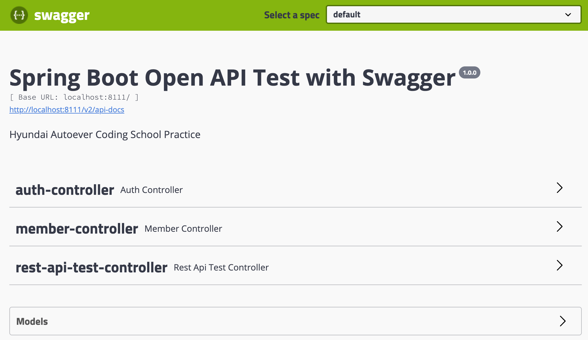
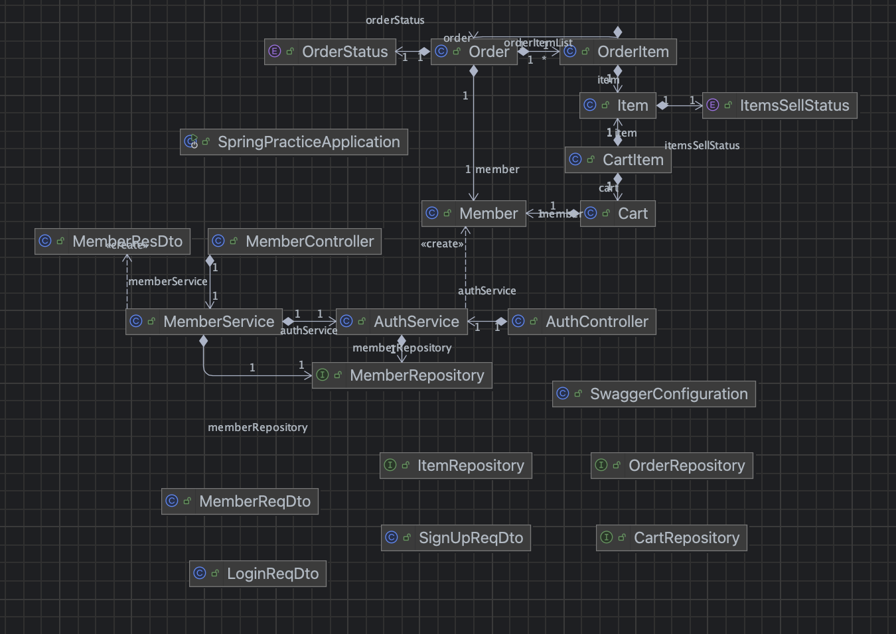
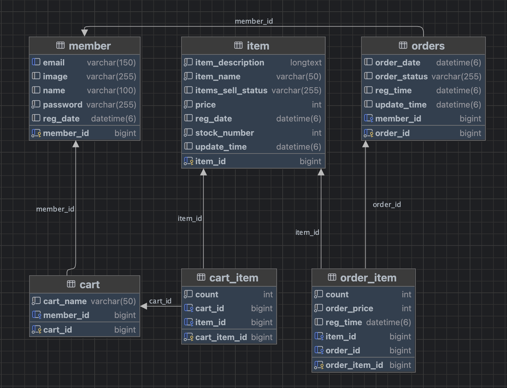

# Spring Boot Practice
- Spring Boot 백엔드 학습 내용 정리
- - -

## 프로젝트 구조
```text
src
├── main/java/com/autoever
│   ├── spring_practice
│   │   ├── SpringPracticeApplication.java
│   │   ├── config
│   │   │   └── SwaggerConfiguration
│   │   ├── constant
│   │   │   ├── ItemsSellStatus
│   │   │   └── OrderStatus
│   │   ├── controller
│   │   │   ├── AuthController
│   │   │   ├── MemberController
│   │   │   └── RestApiTestController
│   │   ├── dto
│   │   │   ├── LoginReqDto
│   │   │   ├── SignUpReqDto
│   │   │   ├── MemberRegDto
│   │   │   └── MemberResDto
│   │   ├── entity
│   │   │   ├── Cart
│   │   │   ├── CartItem
│   │   │   ├── Order
│   │   │   ├── OrderItem
│   │   │   ├── Item
│   │   │   └── Member
│   │   ├── repository
│   │   │   ├── CartRepository
│   │   │   ├── ItemRepository
│   │   │   ├── MemberRepository
│   │   │   └── OrderRepository
│   │   └── service
│   │       ├── AuthService
│   │       └── MemberService
│   ├── resources
│   │   ├── application.properties
│   │   └── application-test.properties
│   └── resources
└── test/java/com/autoever/spring_practice
    ├── SpringPracticeApplicationTests
    └── repository
        ├── OrderRepositoryTest
        ├── ItemRepositoryTest
        └── CartRepositoryTest
```
- - -
## 계층형 아키텍처(Layered Architecture)

소프트웨어 아키텍처는 시스템이 제대로 작동하고 동작하도록 하기 위한 모든 소프트웨서 시스템의 기본 구조이다.
**아키텍처**는 일반적으로 물리적 설계를 의미하지만, 소프트웨어 시스템에서는 구성 요소의 설계, 구성 요소 간의 관계, 사용자 상호작용, 그리고 시스템에 대한 사용자 요구 사항을 포괄한다.

**계층형 아키텍처란?**
- 가장 일반적인 아키텍처 프레임워크로 n계층 아키텍처라고도 한다.  
- 여러 개의 개별 수평 계층이 하나의 소프트웨어 단위로 함께 작동하는 아키텍처 패턴을 설명한다.  
  - 계층은 구성 요소 또는 코드를 논리적으로 분리한 것이다.
- 계층형 아키텍처의 계층 수는 특정 개수로 정해져 있지 않다.
  - 일반적으로 개발자나 소프트웨어 설계자에 따라 달라진다.
- 다음은 일반적인 경우의 계층형 아키텍처이다.
  


1. 프레젠테이션 계층(presentation layer): 소프트웨어 시스템과의 사용자 상호 작용을 담당한다.
2. 애플리케이션 계층(application layer): 기능 요구 사항 달성과 관련된 측면을 처리한다.
3. 도메인 계층(domain layer): 핵심 비즈니스 로직, 알고리즘, 프로그래밍 구성 요소를 담당한다.
4. 인프라/영속성/DB 계층(Infrastructure/persistence/Database layer): 데이터 및 데이터베이스 통신을 담당한다. 

> 이외에는 헥사고날 아키텍처, 클린 아키텍처, 모놀리식 구조, 마이크로서비스 아키텍처 등이 있다.
- - -
### 현재 프로젝트의 계층형 아키텍처
```text
1. 프레젠테이션 계층 (Presentation Layer)
└── controller
    ├── AuthController
    ├── MemberController
    └── RestApiTestController

2. 애플리케이션 계층 (Application Layer)
└── service
    ├── AuthService
    └── MemberService

3. 도메인 계층 (Domain Layer)
├── entity
│   ├── Cart
│   ├── CartItem
│   ├── Item
│   ├── Member
│   ├── Order
│   └── OrderItem
└── constant
    ├── OrderStatus
    └── ItemSellStatus

4. 인프라/영속성 계층 (Infrastructure / Persistence Layer)
└── repository
    ├── CartRepository
    ├── ItemRepository
    ├── MemberRepository
    └── OrderRepository
    
5. 기타 구성 요소
├── dto
│   ├── LoginReqDto
│   ├── SignUpReqDto
│   ├── MemberRegDto
│   └── MemberResDto
└── test
    ├── SpringPracticeApplicationTests
    └── repository
        ├── OrderRepositoryTest
        ├── ItemRepositoryTest
        └── CartRepositoryTest
```

**DTO란?**

- DTO(Data Transfer Object)는 계층 간 데이터 전달을 위한 구조체로, 일반적으로 **컨트롤러와 서비스 사이에서 사용**된다.
  ```text
  [Client]
   │
   ▼
  [Controller] ── uses DTO ──► [Service] ── uses Entity ──► [Repository/DB]
   ▲                             │
   │                             ▼
   Response DTO              [Entity Model]
  ```
- 특정 계층에 속하지는 않지만, 주로 **프레젠테이션 계층과 애플리케이션(비즈니스) 계층 사이에서 데이터 전달** 역할을 수행한다.
- DTO는 **Entity와 분리되어 설계되며**, 이를 통해 다음과 같은 장점을 얻을 수 있다.
  - **보안성**: DB 구조를 외부에 그대로 노출하지 않음.
  - **유연성**: 요청/응답에 맞게 필요한 데이터만 구성 가능함.
  - **관심사 분리**: 데이터 전달과 DB 저장 목적을 명확히 구분함.


- 위 구조는 Spring 기반의 웹 애플리케이션 계층 구조(MVC + Layered Architecture)이다.
- DTO와 Entity를 분리함으로써 **데이터의 이동과 저장 책임을 구분**하고, 유지보수성과 확장성을 높인 구조이다.

- - -
### 애플리케이션 진입점
이해의 편의를 위해 애플리케이션 진입점 부터 설명함.
- - -
#### SpringPracticeApplication.java
스프링 부트 애플리케이션의 진입점
```java
package com.autoever.spring_practice;

import org.springframework.boot.SpringApplication;
import org.springframework.boot.autoconfigure.SpringBootApplication;

@SpringBootApplication
public class SpringPracticeApplication {
	public static void main(String[] args) {
		SpringApplication.run(SpringPracticeApplication.class, args);
	}
}
```
**코드 설명**
- `@SpringBootApplication`: 스프링 부트 애플리케이션의 시작 지점을 나타내는 애너테이션
- 애플리케이션의 실행 시작점으로, 톰캣 서버 실행, Bean 등록, 설정 파일 로드 등을 자동으로 처리한다.

- - -
### 도메인 계층
도메인 계층은 핵심 비즈니스 모델을 정의하는 계층이며, 상위 계층(예: `Item`, `Member`) 등이 도메인 객체를 이용하기 때문에,  
이해의 편의를 위해 도메인 계층부터 설명한다.

- - -
#### Item.java
- 상품 정보를 저장하는 JPA 엔티티로 해당 클래스는 `item` 테이블과 매핑됨.
  - 상품명, 가격, 재고 수향, 설명, 판매 상태 등을 표현함.
- 다음 코드를 통해 시스템에서 상품 정보를 DB에 저장하고 활용하기 위한 도메인 모델이다.

```java
@Getter @Setter // Lombok이 getter와 setter 메서드를 자동을 생성해주는 애너테이션임.
@ToString // ToString: toString() 메서드를 자동으로 생성하여 객체를 로깅할 때 각 필드의 값을 보기 쉽게 출력함.
@Entity // 현재 클래스가 JPA에서 관리되는 엔티티 클래스임을 선언하는 애너테이션임.
@Table(name = "item") // 엔티티가 매핑될 실제 DB 테이블의 이름을 지정함.

public class Item {
    @Id // 해당 필드(id)가 기본 키(PK, Primary Key) 역할을 한다고 지정함.
    @Column(name = "item_id") // Column 이름은 "item_id"로 지정함.
    @GeneratedValue(strategy = GenerationType.AUTO) // PK를 자동 생성함.
    private Long id; // @Id가 가리키는 필드임.

    @Column(nullable = false, length = 50) // null 값을 허용하지 않으며, 길이 제한(50)
    private String itemName; // camelCase로 작성된 itemName은 DB에 snake_case로(item_name)으로 변환된다.

    @Column(nullable = false)
    private int price;

    @Column(nullable = false)
    private int stockNumber;

    @Lob // 해당 필드(itemDescription)를 대용량 데이터로 처리한다는 의미
    @Column(nullable = false, name = "item_description")
    private String itemDescription;

    @Enumerated(EnumType.STRING) // Enum 타입을 DB에 저장할 때 어떤 방식으로 저장할 지 결정한다.
    private ItemsSellStatus itemsSellStatus;

    private LocalDateTime regDate;
    private LocalDateTime updateTime;
}
```

**코드 설명**
- 기본 키
  - `id`: 기본 키(PK, Primary Key)로 자동 생성 전략으로 자동 생성된다.
- 상품 정보 필드
  - `itemName`: 50자 제한이며, `null` 값을 허용하지 않음
  - `price`: `null`이 아닌 가격
  - `stockNumber`: 재고 수량
  - `itemDescription`: `null`이 아닌 상품 설명, 대용량 텍스트
  - `itemSellStatus`: 판매 상태(열거형 ENUM)
  
- 등록일
  - `regDate`: `LocalDateTime`을 이용하여 등록 일시 저장
  - `updateTime`: `LocalDateTime`을 이용하여 수정 일시 저장
    - JPA가 해당 객체를 persist(처음으로 데이터베이스에 저장하기 직전) 되기 전 등록일 필드에 현재 시간 자동 할당함.
    - 즉, `memberRepository.save(member);` 호출 시, persist가 발생한다.

**JPA 애너테이션**
- `@Id`, `id`필드와 `@GeneratedValue`
  - `@Id`: `private Long id`가 기본 키(Primary Key) 역할을 한다고 지정한다.
    - 모든 JPA 엔티티는 반드시 하나의 `@Id` 필드를 가져야한다.
    - 기본 키: 관계형 데이터베이스(RDBMS)에서 테이블의 각 행(row)을 고유하게 식별하기 위해 사용하는 유일한 값이다.
  - `@GeneratedValue`: `private Long id`의 기본 키 값을 생성한다.
    - `strategy = GenerationType.AUTO`: 기본 키 값을 자동 생성 전략을 채택하여 생성함.
- `@Lob`: Large Object의 약자로 대용량 데이터를 처리할 필드에 사용한다.
  - 예시) 문자열의 경우 `CLOB` 타입으로 저장, 바이너리 데이터의 경우 `BLOB`으로 저장한다.
- `@Enumerated`: `Enum` 타입을 DB에 저장할 때 어떤 방식으로 저장할 지 결정한다.
  - Param: `EnumType.STRING`: `enum` 이름 자체를 문자열로 저장한다. 이는 권장되는 방식이다.

- **Lombok 애너테이션**
  - `@ToString`: `toString()` 메서드를 자동으로 생성하여 객체를 로깅할 때 각 필드의 값을 보기 쉽게 출력한다.
  - `@NoArgsConstructor`: 파라미터가 없는 기본 생성자를 자동 생성한다.
    - JPA 규칙: **JPA는 리플렉션을 통해 객체를 생성하므로 기본 생성자가 반드시 필요**하다.
    - 리플렉션(Reflection): 클래스, 메서드, 필드 등의 정보를 런타임에 조회하거나 동적으로 조작할 수 있는 기능이다.

- - -
#### Member.java
- Member 클래스는 사용자 정보를 관리하는 JPA 엔티티이다.
- 해당 클래스는 `member` 테이블과 매핑되며 이름, 이메일, 비밀번호, 프로필 이미지 등을 포함한다.
- 인증, 사용자 관리 기능을 위해 사용되는 기본적인 회원 도메인이다.

```java
@Entity // Member 클래스가 JPA 엔티티임을 나타낸다.
@Table(name = "member") // Member 엔티티가 매핑될 테이블의 이름을 지정한다.
@Getter @Setter
@NoArgsConstructor
public class Member {
    @Id
    @GeneratedValue(strategy = GenerationType.AUTO)
    @Column(name = "member_id")
    private Long id;

    @Column(length = 100) // 길이를 100자로 제한
    private String name;

    @Column(nullable = false)
    private String password;

    @Column(unique = true, length = 150) // 유일한 값을 사용하도록 설정
    private String email;

    @Column(length = 255)
    private String image;

    private LocalDateTime regDate;
    
    @PrePersist // 엔티티가 DB에 저장되기 직전에 실행되는 메서드
    private void prePersist() {         // 라이프사이클 콜백 메서드
        regDate = LocalDateTime.now();  // regDate 필드에 현재 시간 자동 저장된다.
    }
}
```

**코드 설명**
- 기본 키
  - `id`: 기본 키(PK, Primary Key)로 자동 생성 전략으로 자동 생성된다. 
- 회원 정보 필드
  - `name`: 최대 100자까지 허용되는 이름
  - `password`: `null`이 될 수 없는 비밀번호
  - `email`: 유일한(unique) 이메일 주소
  - `image`: 프로필 이미지나 `url`주소
- 등록일
  - `regDate`
    - JPA가 해당 객체를 persist(처음으로 데이터베이스에 저장하기 직전) 되기 전 등록일 필드에 현재 시간 자동 할당함.
    - 즉, `memberRepository.save(member);` 호출 시, persist가 발생한다.

**JPA 애너테이션**
- `@PrePersist`: 엔티티가 DB에 저장되기 직전에 실행되는 애너테이션이다.
  - 사용 목적: 등록 일시 설정, 기본 값 설정, 로깅 등 사전 처리에 사용된다.

- - -
#### Cart
- 회원(Member)이 보유한 장바구니(Cart) 정보를 저장하고 관리하는 도메인 객체이다.
- 회원과 1:1 관계를 가지며 장바구니 식별자, 이름, 소유자를 포함하는 구조를 가지고 있다.

```java
@Getter
@Setter
@ToString
@Entity
@Table(name = "cart")
public class Cart {
    @Id
    @Column(name = "cart_id")
    @GeneratedValue(strategy = GenerationType.AUTO)
    private Long id; // cart에 대한 id 생성

    @Column(nullable = false, length = 50)
    private String cartName;

    @OneToOne // Member entity와 1대1 매핑
    @JoinColumn(name = "member_id")
    private Member member; // 생성된 회원 객체가 와야 한다.
}
```
**코드 설명**
- 기본 키
  - `id`: 장바구니의 고유 식별자
- 장바구니 정보 필드
  - `cartName`: 장바구니의 이름
  - `member`: 장바구니를 소유한 회원
    - `member_id`로 외래 키 매핑됨.
- 관계도
  ```text
  [Member] 1 ---- 1 [Cart]
              member_id(FK)
  ```
  - 각 회원은 하나의 장바구니를 가질 수 있으며, 장바구니는 하나의 회원에 귀속되어야함.

- - -
#### CartItem
- `CartItem`은 장바구니(`Cart`)에 담긴 개별 상품(`Item`)의 정보를 표현하는 연결 엔티티이다.
- 장바구니와 상품 간의 N:M(ManyToMany) 관계를 중간 테이블 형태로 모델링 한다.
  - 하나의 장바구니는 여러 상품을 담을 수 있고, 하나의 상품은 여러 장바구니에 포함될 수 있음.
  - 또한, 동일한 상품이 장바구니에 여러 개 담길 수 있으므로, 수량(`count`) 필드를 통해 명시적으로 관리함.
  - JPA 연관 매핑(`@ManyToOne`) 어노테이션을 통해 `Cart`와 `Item`과의 관계를 선언하여 객체 그래프 탐색을 가능하게 구성됨.
  
```java
package com.autoever.spring_practice.entity;

@Getter
@Setter
@ToString
@Entity
public class CartItem {
    @Id
    @GeneratedValue(strategy = GenerationType.AUTO)
    @Column(name = "cart_item_id")
    private Long id;

    @ManyToOne // 여러 cartItem이 하나의 Cart에 속하므로 N = 1
    @JoinColumn(name = "cart_id")
    private Cart cart;

    @ManyToOne
    @JoinColumn(name = "item_id")
    private Item item;

    private int count;
}
```

**코드 설명**
- 기본 키
  - `id`: `CartItem`의 기본 키
- 장바구니 상품 정보 필드
  - `cart`: `Cart`와의 다대일 관계를 가짐
    - `CartItem`이 하나의 Cart에 속함.
  - `item`: `Item`과의 다대일 관계를 가짐
    - 여러 `CartItem`이 동일한 `Item`을 참조할 수 있음.
  - `count`: 해당 `Item`의 수량
- 관계도
  ```text
  [Cart] 1 ---- N [CartItem] N ---- 1[Item]
  ```
  - 하나의 `Cart`는 여러 개의 `CartItem`을 가질 수 있음.
  - 하나의 `CartItem`은 오직 하나의 `Cart`, `Item`에만 속함.
  - 다대다(N:M) 관계를 표현하는 중간 테이블 엔티티 설계의 형태임.

- - -
#### Order
- 고객 상품의 주문 정보를 표현하는 클래스이다.
- 하나의 주문에 여러 주문 항목(`OrderItem`)이 포함되는 주문 도메인 루트 엔티티이다.
- 목적
  - 주문 정보를 엔티티로 모델링하여 고객이 어떤 상품을 언제, 어떤 상태로 주문했는지 영속성 있게 관리
  - 한 명의 회원이 여러 개의 주문을 할 수 있으므로 다대일 관계로 설정
  - 하나의 주문은 여러 개의 주문 항목으로 구성되므로 일대다 관계로 설정
```java
@Getter
@Setter
@ToString
@Entity
@Table(name = "orders") // DB의 예약어와의 충돌을 방지하기 위해 table의 이름을 orders로 변경
public class Order {
    @Id
    @GeneratedValue
    @Column(name = "order_id")
    private Long id;

    @ManyToOne
    @JoinColumn(name = "member_id")
    private Member member;

    private LocalDateTime orderDate; // 주문 일

    @Enumerated(EnumType.STRING)
    private OrderStatus orderStatus;

    private LocalDateTime regTime;
    private LocalDateTime updateTime;

    @OneToMany(mappedBy = "order", cascade = CascadeType.ALL)
    private List<OrderItem> orderItemList = new ArrayList<>();
}

```

**코드 설명**
- 기본 키
  - `id`: `Order`의 기본 키
- 주문 정보 필드
  - `member`: 주문한 회원 정보와 다대일로 연관됨.
  - `orderDate`: 주문 발생 시각
  - `orderStatus`: 주문 상태(예: ORDER, CANCEL)
  - `regTime`/ `updateTime`: 생성/수정 시간 기록
  - `orderItemList`: 주문에 포함된 상품 항목 리스트
    - 여러 `CartItem`이 동일한 `Item`을 참조할 수 있음.
  - `count`: 해당 `Item`의 수량
- 관계도
  ```text
  [Member] 1 ---- N [Order] N ---- 1[OrderItem]
  ```
  - 하나의 회원은 여러 주문을 생성할 수 있음.
  - 하나의 주문은 여러 개의 주문 항목을 포함할 수 있음.

- - -
#### OrderItem
- `OrderItem`은 하나의 주문에 포함된 개별 상품의 상세 내역을 나타내는 엔티티로 어떤 상품이 몇 개, 얼마에 주문되었는지 표현한다.
- `Order`와 `Item` 사이의 다대다(N:M) 관계를 해소하기 위한 중간 테이블의 역할을 수행한다.
- 목적
  - `Order`와 `Item`은 직접적인 다대다 관계 대신, 중간 엔티티 `orderItem`을 통해 다대일 관계로 두 개로 구성함.
  - 상품 가격, 수량, 등록 시간 등의 주문의 상세 데이터를 개별 항목 단위로 관리함.
  - JPA를 통한 연관 관계 매핑으로 데이터 정합성과 일관성을 유지함.

```java
package com.autoever.spring_practice.entity;

@Getter
@Setter
@ToString
@Entity

public class OrderItem {
    @Id
    @GeneratedValue
    @Column(name = "order_item_id")
    private Long id;

    @ManyToOne
    @JoinColumn(name = "item_id")
    private Item item;

    @ManyToOne
    @JoinColumn(name = "order_id")
    private Order order;

    private int orderPrice;
    private int count;
    private LocalDateTime regTime;
}

```

**코드 설명**
- 기본 키
  - `id`: `OrderItem`의 기본 키
- 주문 정보 필드
  - `item`: 해당 주문 항목에 포함된 상품
  - `order`: 주문 항목이 속한 주문
  - `orderPrice`: 해당 항목의 가격
  - `count`: 주문된 수량
  - `regTime`: 주문 항목 등록 시각
- 관계도
  ```text
  [Order] 1 ---- N [OrderItem] N ---- 1[Item]
  ```
  - 한 주문은 여러 개의 주문 항목을 가질 수 있음.
  - 각 주문 항목은 하나의 상품에 대응됨.

- - -
### 영속성 계층
- 영속성 계층(persistence layer)은 도메인 객체와 데이터베이스 간의 CRUD의 작업을 담당하는 계층이다.
- 주로 **Repository interface**를 통해 구현된다.
- 비즈니스 로직과 데이터 접근 로직을 명확히 분리하여 유지보수성과 확장성을 높인다.
- Spring에서는 Spring Data JPA를 통해 복잡한 구현 없이도 JPA 기반의 데이터 접근 기능을 추상화하고 자동화 한다.

**Repository 구성 목록**
- ItemRepository: 상품의 이름, 설명 기반 CRUD 기능 제공
- CartRepository: 장바구니 정보에 대한 CRUD 기능 제공
- MemberRepository: 회원에 대한 CRUD 기능 제공
- OrderRepository: 주문에 대한 CRUD 기능 제공

- - -
#### ItemRepository
- `Item`엔티티에 대한 데이터 접근 기능을 담당하는 JPA 기반 Repository 인터페이스이다.
- 비즈니스 로직과 분리된 데이터 접근 로직(Data Access Login)을 정의한 것이다.
- Spring Data JPA의 추상화를 활용하여, 반복적인 CRUD 코드 없이도 쿼리 메서드를 자동 생성 및 활용 가능하다.

```java
package com.autoever.spring_practice.repository;

@Repository // Spring이 해당 인터페이스를 Repository Bean으로 인식하게 하는 애너테이션

public interface ItemRepository extends JpaRepository<Item, Long> {
    List<Item> findByItemName(String itemName); // item_name을 이용하여 상품 검색
    List<Item> findByItemNameOrItemDescription(String itemName, String itemDescription); // item_name 또는 description을 이용하여 상품 검색
    
    // JPQL 기반의 쿼리 메서드
    @Query("SELECT i FROM Item i WHERE i.itemDescription like %:itemDescription% ORDER BY i.price desc")
    List<Item> findByItemDescription(@Param("itemDescription") String itemDescription);

    // Native Query 기반의 쿼리 메서드: 해당하는 DB의 실제 쿼리를 작성, 복잡한 쿼리를 작성 가능하다.
    @Query(value = "SELECT * FROM item i WHERE i.item_description " +
            "LIKE %:itemDescription% ORDER BY i.price DESC", nativeQuery = true)
    List<Item> findByItemDescriptionByNativeQuery(@Param("itemDescription") String itemDescription);
}
```

**코드 설명**
- 클래스 선언 부
  ```java
  @Repository
  public interface ItemRepository extends JpaRepository<Item, Long> { ... }
  ```
  - `@Repository`: Spring이 해당 인터페이스를 Repository Bean으로 인식하게 함.
  - `JpaRepository<Item, Long>`
    - `JpaRepository`는 `save()`, `findById()`, `delete()` 등의 기본 CRUD 메서드를 자동으로 제공함.
    - `<Item, Long>`: `Item` 엔티티의 기본 키 타입이 `Long`임을 명시함.

- **JPA 메서드**
  - findByItemName
    ```java
    List<Item> findByItemName(String itemName);
    ```
    - `item_name`이 특정 문자열과 일치하는 상품 목록 조회
    - JPQL 자동 생성 해줌, `SELECT i FROM Item i WHERE i.itemName = :itemName`
  - findByItemNameOrItemDescription
    ```java
    List<Item> findByItemNameOrItemDescription(String itemName, String itemDescription);
    ```
    - `item_name` 또는 `item_description`이 조건에 일치하는 상품을 검색함.
    - JPQL 자동 생성 쿼리문: `SELECT i FROM Item i WHERE i.itemName = :itemName OR i.itemDescription = :itemDescription`

- **JPQL 및 Native Query 기반 메서드**
  - JPQL 기반 메서드
    ```java
    @Query("SELECT i FROM Item i WHERE i.itemDescription like %:itemDescription% ORDER BY i.price desc")
    List<Item> findByItemDescription(@Param("itemDescription") String itemDescription);
    ```
    - `@Query`: JPA에서 제공하는 JPQL 쿼리
    - `@Param("itemDescription")`: 메서드 매개변수를 JPQL 쿼리 안의 :itemDescription에 바인딩
      > `String itemDescription`과 `@Param("itemDescription")`의 차이점  
      `String itemDescription`: Java 메서드의 매개변수.  
      `@Param("itemDescription")`: Spring Data JPA에서 Native Query에 전달할 파라미터의 이름을 지정하는 애너테이션.  
    - `itemDescription`에 특정 문자열이 포함된 상품을 가격 기준으로 내림차순 정렬하여 조회함.
  - Native Query 기반 메서드
    ```java
    @Query(value = "SELECT * FROM item i WHERE i.item_description " +
    "LIKE %:itemDescription% ORDER BY i.price DESC", nativeQuery = true)
    List<Item> findByItemDescriptionByNativeQuery(@Param("itemDescription") String itemDescription);
    ```
    - `@Query`의 `nativeQuery = true`로 실제 SQL 문장을 작성한 것임을 명시함.
    - 마찬가지로 `@Param("itemDescription")`으로 메서드 매개변수를 SQL 쿼리 안의 :itemDescription에 바인딩함.

- - -
#### MemberRepository
- `MemberRepository`는 `Member`엔티티에 대한 데이터 접근을 담당하는 Spring Data JPA 기반의 라포지토리 인터페이스이다.
- `JpaRepository<Member, Long>`을 상속함으로써, `Member`엔티티에 대한 기본적인 CRUD 메서드를 사용 가능하다.
- 이 인터페이스는 `@Repository` 애너테이션이 없어도 Spring이 자동으로 인식하여 빈으로 등록한다.

```java
package com.autoever.spring_practice.repository;

import com.autoever.spring_practice.entity.Member;
import org.springframework.data.jpa.repository.JpaRepository;

import java.util.Optional;

// JPA 라포지토리 인터페이스를 상속하여 Member 엔티티를 대상으로 id가 Long 타입인 CRUD 기능을 상속 받는다.
public interface MemberRepository extends JpaRepository<Member, Long> {
    // 이메일 존재 여부 확인
    boolean existsByEmail(String email);

    // 이메일 주소로 회원 정보를 조회
    // 결과가 없을 수 있으므로 Optional<Member>로 반환하여 null 처리를 명확히 한다.
    Optional<Member> findByEmail(String email);

    // 이메일과 비밀번호를 이용하여 회원 정보를 조회하며, 로그인 성공 및 실패를 확인하기 위해 사용된다.
    // 마찬가지로 결과가 없을 수 있으므로 Optional으로 반환한다.
    Optional<Member> findByEmailAndPassword(String email, String password);
}
```

**코드 설명**
- `@Repository`
  - Spring Data JPA의 Repository 인터페이스(JpaRepository)를 상속 받은 경우, 해당 인터페이스는 직접 구현체가 없어도 자동으로 Bean으로 등록된다.
- 사용자 정의 쿼리 메서드
  - `existsByEmail(String email)`
    - 지정한 이메일이 DB에 존재하는지 여부를 `boolean`값으로 반환한다.
    - Spring Data JPA의 메서드 이름 기반 쿼리 생성 기능을 활용한 것으로, 다음과 같은 JPQL이 자동으로 생성되었다.
    - `SELECT CASE WHEN COUNT(m) > 0 THEN TRUE ELSE FALSE END FROM Member m WHERE m.email =: email`
  - `findByEmail(String email)`
    - 이메일 주소로 회원 정보를 조회한다.
    - 위와 동일하게 자동으로 JPQL으로 변환된다.
    - `SELECT m FROM Member m WHERE m.email =: email`
  - `findByEmailAndPassword`
    - 이메일과 비밀번호를 이용하여 로그인 성공 및 실패를 검증한다.
    - 위와 동일하게 자동으로 JPQL으로 변환된다.
    - `SELECT m FROM Member m WHERE m.email = :email AND m.password = :password`

- - -
#### OrderRepository
- `OrderRepository`는 `Order` 엔티티에 대한 데이터 접근을 담당하는 Spring Data JPA 기반의 Repository 인터페이스이다.
- `JpaRepository<Order, Long>`을 상속하여 기본적인 CRUD 기능을 제공한다.
- 추후, 주문 일자, 주문 상태 등을 기반으로 하는 쿼리 메서드를 확장할 수 있는 구조이다.

```java
public interface OrderRepository extends JpaRepository<Order, Long> {
}

```

- - -
#### CartRepository
- `CartRepository`는 `Cart` 엔티티에 대한 데이터 접근을 담당하는 Spring Data JPA 기반의 Repository 인터페이스이다.
```java
@Repository
public interface CartRepository extends JpaRepository<Cart, Long> {
}

```
- - -
### 애플리케이션 계층
- 애플리케이션 계층은 소프트웨어 시스템의 비즈니스 작업(Use Case)을 조합하고 실행하는 역할을 담당하는 계층이다.
- 도메인 계층에 정의된 비즈니스 규칙을 호출하고, 외부 요청(controller)과 내부 로직(entity, repository) 간의 중재자 역할을 수행한다.

- - -
#### AuthService
```java
@Slf4j
@Service // 해당 클래스가 비즈니스 로직을 담는 서비스 컴포넌트임을 명시함.(Spring Bean으로 등록)
@Transactional // 클래스 내 메서드에 대해 트랙잭션을 자동 적용하여 데이터 정합성을 보장함.
@RequiredArgsConstructor // final 필드를 자동으로 생성자 주입하여 의존성 주입(DI) 구현함.

public class AuthService {
    private final MemberRepository memberRepository; // 생성자를 통해 의존성 주입 받음.

    // MemberReqDto를 Member 엔티티로 수동 매핑함.
    private Member convertDtoToEntity(MemberReqDto memberReqDto) {
        Member member = new Member();
        member.setEmail(memberReqDto.getEmail());
        member.setPassword(memberReqDto.getPassword());
        member.setName(memberReqDto.getName());
        return member;
    }

    // 이메일로 기존 회원 여부를 조회함.
    public boolean isMember(String email) {
        return memberRepository.existsByEmail(email); // 내부적으로 MemberRepository.existsByEmail()을 호출하여 DB에 해당 이메일이 존재하는지 확인함.
    }

    // 회원가입 요청 정보를 담고 있는 DTO을 받아, Member 엔티티로 변환 후 저장함.
    public boolean signUp(MemberReqDto memberReqDto) {
        try {
            Member member = convertDtoToEntity(memberReqDto); // 회원가입 요청 정보를 담고 있는 Dto를 받아 Member 엔티티로 변환 후 저장함.
            memberRepository.save(member);
            return true;

        } catch (Exception e) { // 예외 발생 false를 반환하고 로그에 오류 메시지를 출력함.
            log.error("회원 가입 시 오류 발생: {}", e.getMessage());
            return false;
        }
    }

    // 이메일과 비밀번호로 회원을 조회하고 존재 여부에 따라 로그인 성공 여부를 반환함.
    public boolean login(String email, String password) {
        Optional<Member> member = memberRepository.findByEmailAndPassword(email, password); // 내부적으로 findByEmailAndPassword() 호출
        return member.isPresent(); // member의 존재 여부를 boolean으로 확인
    }
}

```
- - -
#### MemberService
- `MemberService`는 사용자 정보 관리(회원 조회, 수정, 삭제 등)를 담당하는 애플리케이션 계층의 서비스 클래스이다.
- `AuthService`가 인증(가입/로그인)을 담당한다면, `MemberService`는 그 이후의 회원 관리 기능을 책임진다.
- `Controller`로부터 호출하여 요청을 처리하고, 내부적으로 `MemberRepository`와 `Member` 엔티티를 조작하여 결과를 반환한다.

```java
@Slf4j
@Service
@Transactional // 클래스 내의 모든 메서드에 트랜잭션을 적용함.
@RequiredArgsConstructor // final 필드를 대상으로 생성자를 자동 생성하여 의존성 주입을 수행함.
public class MemberService {
    private final AuthService authService;
    private final MemberRepository memberRepository;

    // Entity를 DTO로 변환하는 메서드
    // Member 엔티티를 MemberResDto로 변환하여 반환하는 내부 메서드
    // 비즈니스 로직과 프레젠테이션 계층 간 데이터 분리 및 보안성 확보
    public MemberResDto convertEntityToDto(Member member) {
        MemberResDto memberResDto = new MemberResDto();
        memberResDto.setEmail(member.getEmail());
        memberResDto.setName(member.getName());
        memberResDto.setPassword(member.getPassword());
        memberResDto.setRegDate(member.getRegDate());
        memberResDto.setImage(member.getImage());
        return memberResDto;
    }

    // 회원 전체 조회: DB에 존재하는 모든 회원 정보를 조회하고, 이를 MemberResDto 형태로 반환하여 리스트로 반환함.
    public List<MemberResDto> findAll() {
        List<Member> members = memberRepository.findAll(); // DB의 정보를 Member Entity에 담음
        List<MemberResDto> memberResDtoList = new ArrayList<>(); // Dto List 생성

        for (Member member : members) {
            memberResDtoList.add(convertEntityToDto(member));
        }
        return memberResDtoList;
    }
    
    // 상세 회원 조회: 이메일을 기준으로 회원을 찾음.
    public MemberResDto findByEmail(String email) {
        Member member = memberRepository.findByEmail(email).orElseThrow(
                () -> new RuntimeException("해당 회원이 존재하지 않습니다.") // 회원이 존재하지 않는 경우에는 RuntimeException을 반환함.
        );
        return convertEntityToDto(member);
    }

    // 회원 정보 수정: 이메일을 기준으로 회원을 찾고, 해당 정보를 Dto 값으로 수정함.
    public boolean modifyMember(MemberResDto memberResDto) {
        try {
            Member member = memberRepository.findByEmail(memberResDto.getEmail()).orElseThrow(
                    () -> new RuntimeException("해당 회원이 존재하지 않습니다.")
            );
            member.setEmail(memberResDto.getEmail());
            member.setPassword(memberResDto.getPassword());
            memberRepository.save(member); // save()를 통해 변경 사항을 영속화하며 성공 여부는 boolean으로 반환함.
            return true;
        } catch (Exception e) {
            log.error("회원 정보 수정 실패: {}", e.getMessage());
            return false;
        }
    }

    // 회원 정보 삭제: 이메일을 기분으로 회원을 조회하고 삭제함.
    public boolean deleteMember(String email) {
        try {
            Member member = memberRepository.findByEmail(email).orElseThrow(
                    () -> new RuntimeException("해당 회원이 존재하지 않습니다.") // 회원 정보가 없으면 500 error를 발생시키며 메시지를 전달
            );
            memberRepository.delete(member); // 회원 정보 삭제
            return true;
        } catch (Exception e) {
            log.error("회원 정보 삭제 실패: {}", e.getMessage());
            return false;
        }
    }
}
```

- - -
### 프레젠테이션 계층
- 프레젠테이션 계층은 사용자와 직접 상호작용하는 계층이다.
- 사용자로부터 HTTP 요청을 수신하고, 이를 애플리케이션 계층(`service`)에 전달한 뒤 처리 결과를 HTTP 응답으로 반환하는 역할을 한다.
- 주요 역할
  - 요청 수신: 클라이언트로부터 HTTP 요청을 수신
  - 요청 매핑: URL, HTTP method(GET, POST 등)에 따라 컨트롤러 메서드로 매핑
  - DTO 매핑: 요청 JSON 데이터를 DTO 객체로 매핑하여 서비스에 전달
  - 응답 반환: 서비스 결과를 클라이언트에게 JSON 등의 형식으로 반환

- - -
#### MemberController
- `MemberController`는 회원 정보 관리 기능(조회, 수정, 삭제)을 처리하는 프레젠테이션 

```java
@Slf4j
@RestController // REST API 응답(JSON)을 반환하는 컨트롤러 클래스 임을 선언함.
@RequiredArgsConstructor  // final 필드에 대한 생성자를 자동 생성하여 의존성 주입 수행함.
@CrossOrigin(origins = { // CORS 정책 허용 - React 앱(포트 3000, 5173)에서의 접근 허용
        "http://localhost:3000",
        "http://localhost:5173"
})
@RequestMapping("/users") // 이 컨트롤러의 모든 경로는 /user로 시작함.
public class MemberController {
    private final MemberService memberService;

    // 회원 전체 조회: 모든 회원 정보를 조회하여 List<MemberResDto> 형태로 반환함.
    @GetMapping("/list") // 이 메서드의 경로는 /user/list임.
    public ResponseEntity<List<MemberResDto>> getMembers() {
        return ResponseEntity.ok(memberService.findAll()); // 응답 상태 HTTP 200 OK
    }

    // 회원 상세 조회: 특정 이메일을 기반으로 회원 정보를 조회함.
    @GetMapping("/detail/{email}") // 이 메서드의 경로는 /user/detail/testEmail임
    public ResponseEntity<MemberResDto> getMember(@PathVariable String email) { // URL 경로 변수로 이메일을 받아, MemberService.findByEmail(email)을 호출함.
        return ResponseEntity.ok(memberService.findByEmail(email));
    }

    // 회원 정보 수정
    @PutMapping("/modify") // 이 메서드의 경로를 /user/modify임
    public ResponseEntity<Boolean> updateMember(@RequestBody MemberResDto memberResDto) { // 요청 본문(@RequestBody)에 담긴 회원 정보를 바탕으로 수정 작업을 수행한다.
        return ResponseEntity.ok(memberService.modifyMember(memberResDto));
    }

    // 회원 삭제: 이메일을 기준으로 해당 회원을 삭제한다.
    @DeleteMapping("/delete/{email}")
    public ResponseEntity<Boolean> deleteMember(@PathVariable String email) {
        return ResponseEntity.ok(memberService.deleteMember(email));
    }
}
```

**데이터 흐름**
```text
[Client] ⇄ [MemberController]
                    │
                    ▼
            [MemberService]
                    │
                    ▼
           [MemberRepository / Member Entity]
```
- 요청 JSON은 `MemberResDto`로 매핑되고, 
- 응답은 `MemberResDto` 또는 `Boolean`으로 전달된다.

- - -
#### AuthController
- `AuthController`는 사용자 인증(Authentication)과 관련된 요청을 처리하는 프레젠테이션 계층의 컨트롤러이다.
- 클라이언트가 회원 가입, 로그인, 이메일 중복 확인 등을 요청할 때 진입하는 REST 엔드포인트를 제공하며, 내부적으로 AuthService를 호출하여 로직을 처리한다.

```java
@Slf4j
@RestController // REST API 요청을 처리하고 JSON 응답을 반환하는 컨트롤러임.
@RequiredArgsConstructor
@RequestMapping("/auth")
public class AuthController {
    private final AuthService authService;

    // 이메일 중복 확인: 이메일을 전달 받아, 이미 등록된 이메일인지 확인함.
    @GetMapping("/exists/{email}")
    public ResponseEntity<Boolean> existsByEmail(@PathVariable String email) { // 내부적으로 authService.isMember(email)을 호출하여 DB를 조회함.
        boolean isExists = authService.isMember(email);
        return ResponseEntity.ok(!isExists); // 응답은 사용 가능 여부를 의미하며, 중복되지 않았을 경우 true를 반환함.
    }

    // 회원 가입: 전달 받은 @RequestBody를 MemberReqDto로 수신함.
    @PostMapping("/signup")
    public ResponseEntity<Boolean> signUp(@RequestBody MemberReqDto memberReqDto) {
        boolean isSuccess = authService.signUp(memberReqDto);
        return ResponseEntity.ok(isSuccess); // 가입 성공 여부를 Boolean 형태로 응답함.
    }

    // 로그인: 이메일과 비밀번호를 담은 LoginReqDto를 @RequestBody로 전달 받음.
    @PostMapping("/login")
    public ResponseEntity<Boolean> login(@RequestBody LoginReqDto loginReqDto) { 
        boolean isSuccess = authService.login(loginReqDto.getEmail(), loginReqDto.getPassword());
        return ResponseEntity.ok(isSuccess); // 로그인 성공 시 true를 반환함.
    }

}
```

**데이터 흐름 구조**
```text
[Client] 
   ↓ (HTTP 요청: /auth/signup, /auth/login 등)
[AuthController]
   ↓ (DTO 매핑)
[AuthService]
   ↓ (비즈니스 로직 수행)
[MemberRepository / Entity]
   ↑
[AuthService]
   ↑
[AuthController]
   ↑ (ResponseEntity 반환)
[Client]
```

- - -
#### RestApiTestController
- 간단한 REST API 테스트 하기 위한 컨트롤러 클래스이다.
- GET 방식 요청을 처리하며, URL 경로 변수, 쿼리 파라미터 기본 응답 처리 방식을 실습하는 예제이다.
```java
@RestController
@RequestMapping("/api")
public class RestApiTestController {
    @GetMapping("/hello")
    public String getHello() {
        return "Hello Spring Boot!";
    }

    @GetMapping("/board/{variable}")
    public String getVariable(@PathVariable String variable) {
        return variable;
    }
    
    public String getRegParam(
            @RequestParam String name,
            @RequestParam String email,
            @RequestParam String company
    ) {
        return name + " " + email + " " + company;
    }
}
```

- - -
### DTO
- DTO는 계층 간 데이터 전달을 위한 객체로 프레젠테이션 계층(controller)과 애플리케이션 계층(service) 사이에서 사용된다.
- DTO는 DB와 직접 연동되는 `Entity` 객체와는 다르게, 입력/출력 데이터를 목적에 맞게 가공하여 전달한다.
- 주요 목적
  - 데이터 캡술화: 클라이언트로부터 전달받거나 응답할 데이터를 구조화함.
  - 보안성 확보: `Entity`를 직접 노출하지 않음으로 DB 구조 보호
  - 유연성 향상: 필요한 필드만 포함하여 클라이언트 요구사항에 맞는 형태로 데이터를 전달함.
  - 관심사 분리: `View/Controller` 계층과 `Entity`(도메인 모델) 간의 책임을 분리함.

**사용 흐름**
```text
[Client] → [Controller] → [DTO] → [Service] → [Entity] → [Repository]
                    ↑                          ↓
                응답 DTO                 DB 저장용 Entity
```
- 입력 요청: 클라이언트에서 전송항 JSON은 DTO로 파싱됨.
- 출력 응답: `Entity` -> `DTO`로 변환하여 민감 정보 없이 결과를 반환함.

- - -
#### LoginReqDto
- `LoginReqDto`는 로그인 요청 시 클라이언트로부터 전달되는 데이터(email, password)를 담는 DTO 클래스이다.
- 주로 `POST` `/auth/login` 요청에서 `@RequestBody`를 통해 JSON 요청을 객체로 변환하는데 사용된다.

```java
@Getter
@Setter
@NoArgsConstructor // 파라미터가 없는 기본 생성자 자동 생성함.

public class LoginReqDto {
    private String email;
    private String password;
}
```

**사용 예시**
- JSON 요청 본문
```json
{
  "email": "user@example.com",
  "password": "secure1234"
}
```

- Controller에서 사용
```java
@PostMapping("/login")
public ResponseEntity<Boolean> login(@RequestBody LoginReqDto loginReqDto) {
    return ResponseEntity.ok(authService.login(
        loginReqDto.getEmail(),
        loginReqDto.getPassword()
    ));
}
```

- - -
#### MemberReqDto 
- `MemberReqDto`는 클라이언트가 회원 가입 요청 시 전달하는 입력 데이터를 담는 전용 DTO 클래스이다.
- 이 DTO는 `Controller`에서 JSON 요청 본문을 객체로 바인딩한 뒤, `Service` 계층으로 전달되어 `Entity` 변환되어 저장되는 역할을 한다.

```java
@Getter
@Setter
@NoArgsConstructor

public class MemberReqDto {
    private String email;
    private String password;
    private String name;
}

```

**사용 예시**
```text
[클라이언트] → (JSON 요청) → [AuthController] → [MemberReqDto] → [AuthService] → [Member Entity] → [Repository]
```
- 클라이언트가 회원 가입 정보를 JSON으로 전송
- `@RequestBody`를 통해 JSON이 `MemberReqDto` 객체로 자동 바인딩
- `Service` 계층에서 `MemberReqDto`를 `MemberEntity` 변환
- 변환된 `Entity`를 DB에 저장

**요청 JSON**
```json
{
  "email": "user@example.com",
  "password": "secure1234",
  "name": "홍길동"
}
```

- - -
#### MemberResDto
- `MemberResDto`는 회원 정보를 클라이언트에 응답할 때 사용하는 출력 전용 DTO 클래스이다.
- 서비스 계층에서 `Entity (Member)` 객체를 클라이언트에 전달하기 적절한 형식으로 변환하여 반환하는데 사용된다.
```java
@Getter
@Setter
@NoArgsConstructor @AllArgsConstructor
public class MemberResDto {
    private String email;
    private String name;
    private String password;
    private String image;
    private LocalDateTime regDate;
}
```
**사용 흐름**
```text
[DB Member Entity] → [MemberService] → [MemberResDto] → [Controller] → [클라이언트 응답]
```
- `Repository`를 통해 조회된 `Member`엔티티 객체를 
- `Service` 계층에서 `MemberResDto`로 변환하고
- `Controller`에서 클라이언트에 응답(`ResponseEntity`)에 담아 반환한다.

- - -
#### SignUpReqDto
- `SignUpReqDto`는 회원 가입 요청 시 클라이언트로부터 전달받는 입력 데이터를 담는 DTO이다.
- 주로 POST `/auth/signup`과 같은 API에서 요청(Request) 바디로 전달되는 JSON 데이터를 자바 객체로 매핑하는 데 사용된다.
```java
@Getter
@Setter
@NoArgsConstructor
public class SignUpReqDto {
    private String email;
    private String password;
    private String name;
}
```
**사용 흐름**
```text
[Client] → [Request Body(JSON)] → [SignUpReqDto] → [Controller] → [Service] → [Entity로 변환 후 저장]
```
- 클라이언트에서 회원 가입 폼을 작성하여 서버로 전송
- Spring이 JSON 데이터를 `SignUpReqDto`로 바인딩하여 `Controller`로 전달
- 이후 `AuthService`등에서 DTO를 `Member Entity`로 변환하여 저장 처리한다.

**요청 JSON**
```json
{
  "email": "test@example.com",
  "password": "secure1234",
  "name": "홍길동"
}
```
- - -
## 설정 파일
- - -
### Swagger
- Open API의 Swagger는 RESTful API 문서화 및 테스트를 위한 도구 및 프레임워크이다.
- Spring Boot와 함께 사용하면 API 명세 자동 생성, 테스트용 UI 제공, 개발자와 클라이언트 간의 소통 효율화 등의 목적을 달성 할 수 있다.
  - API 명세 자동 생성: Spring의 `@RestController`, `@RequestMapping`, `@GetMapping` 등을 기반으로 API 설명 자동 추출
  - Swagger UI 제공

- - -
#### Swagger 설정 방법
1. **의존성 추가**
```groovy
dependencies {
  implementation 'org.springdoc:springdoc-openapi-ui:1.6.15'
}
```
- 최신 Spring Boot에서는 `springdoc-openapi`가 Swagger 기능을 제공하는 표준이다.
2. Swagger 설정 클래스
```java
@Slf4j
@Configuration // 해당 클래스가 Spring 설정 클래스임을 나타낸다. Bean 등록이 가능함.
@EnableSwagger2 // Swagger 2 사용을 활성화함.
public class SwaggerConfiguration {
    @Bean
    public Docket api() {
        log.info("[Message] Request Swagger Configuration");
        return new Docket(DocumentationType.SWAGGER_2)
                .apiInfo(apiInfo()) // 아래의 apiInfo() 메서드를 통해 API의 정보 설정 
                .select()
                .apis(RequestHandlerSelectors.basePackage("com.autoever.spring_practice"))
                .paths(PathSelectors.any()) // 모든 경로 포함
                .build();
    }
    
    private ApiInfo apiInfo() { // Swagger Api 페이지에 표시할 정보 입력
        log.info("[Message] Request Swagger Configuration apiInfo()");
        return new ApiInfoBuilder()
                .title("Spring Boot Open API Test with Swagger")
                .description("Hyundai Autoever Coding School Practice")
                .version("1.0.0")
                .build();
    }
}
```
**코드 설명**
- `Docket`: Swagger 설정 객체로 Swagger 문서의 전반적인 동작 방식을 정의하는 도구임.
- `DocumentationType.Swagger2`: Swagger 2.0 문서 형태로 생성함.

- - -
#### Swagger 사용 방법
**기본 접속 URL**
```text
http://localhost:포트번호/swagger-ui.html
```

위의 경우에서는 다음 주소를 입력하면 사용 가능하다.
```text
http://localhost:8111/swagger-ui.html
```

서버를 실행시키고 위 링크를 접속하면 다음과 같은 웹 페이지로 이동 가능하다.


- - -
### application.properties
- Spring Boot의 설정 파일로 다음과 같은 설정들을 포함한다.
  - 서버 설정: 포트 번호, 인코딩 방식 등
  - DB 연결 설정: JDBC URL, 사용자명, 비밀번호, 드라이버 설정 등
  - JPA 설정: 쿼리 로그 출력 등
  - 로깅 설정
  - 기타 스프링 설정: 경로 매칭 전략, 캐시, 메시지 소스 등

**서버 포트 설정**
```properties
server.port=8111
```
- 애플리케이션을 8111번 포트에서 실행함.
  - 기본 값은 8080임.

**MySQL 데이터베이스 연결 정보**
```properties
spring.datasource.driver-class-name=com.mysql.cj.jdbc.Driver
spring.datasource.url=jdbc:mysql://localhost:3306/autoever_jpa_mysql_0605
spring.datasource.username=root
spring.datasource.password=4109
```

**경로 매핑 전략 설정**
```properties
spring.mvc.pathmatch.matching-strategy=ant_path_matcher
```
- 경로 매핑 전략(Path Matching Strategy)을 `AntPathMathcer`로 지정함.
  - 경로 매핑 전략: Spring에서 HTTP 요청 경로(URL)을 어떤 방식으로 해석하고 매핑할 지 결정하는 방법이다.
  - 이는 주로 `@RequestMapping`, `@GetMapping`, `@PostMapping` 등에서 URL 패턴과 실제 요청을 비교하여 어떤 컨트롤러 메서드가 실행될 지 결정하는 로직이다.

**SQL 출력 및 로그 상세 등의 기타 정보**
```properties
spring.jpa.properties.hibernate.show_sql=true
spring.jpa.properties.hibernate.format_sql=true
logging.level.org.hibernate.type.descriptor.sql=trace
spring.jpa.properties.hibernate.dialect=org.hibernate.dialect.MySQL8Dialect
spring.jpa.hibernate.ddl-auto=create
```

- - -
### build.gradle
- `Gradle`기반 프로젝트에서 빌드 설정 파일로 사용되는 파일이다.
- 다음 항목들을 설정하게 된다.
  - plugins: 사용할 플러그인 지정함.
  - dependencies: 프로젝트에서 사용할 라이브러리 의존성을 명시함.
  - repositories: 외부 라이브러리를 가져올 저장소 위치를 명시함.
  - task: 테스크, 빌드 등의 작업을 정의함.

- - -
## 클래스 구조


- - -
## 데이터 베이스 구조



- - -

## 추가 개념 설명
- - -
### JPA
- JPA(Java Persistence API): Java 객체와 관계형 데이터베이스 사이의 매핑을 정의하는 표준 인터페이스 사양이다.
  - 자바에서 객체와 관계형 데이터베이스 사이의 매핑을 도와주는 ORM(Objected-Relational Mapping) 표준 인퍼페이스이다.
  - JPA 동작 흐름
```text
[Entity 클래스 작성] 
     ↓
[Repository 생성 (Spring Data JPA)]
     ↓
[Service에서 save(), findById() 등 호출]
     ↓
[JPA가 SQL로 변환하여 DB에 실행]
     ↓
[결과를 자바 객체로 매핑하여 반환]
```
- Hibernate(JPA 구현체): JPA를 실제로 구현한 라이브러리로 Entity와 Table 같에 매핑을 처리한다.
- Spring Data JPA: JPA를 Spring과 통합하여 Repository 인터페이스만으로 쿼리 메서드를 자동 생성하는 기능을 제공한다.

#### Spring Data JPA: JpaRepository
Spring Data JPA에서 제공하는 JpaRepository는 다음과 같은 CRUD 메서드들을 자동을 사용할 수 있다.

| 메서드                           | 설명                               |
|-------------------------------|----------------------------------|
| `save(Repository repository)` | `Repository` 객체를 저장하거나 수정        |
| `findById(Long id)`           | 기본 키(`id`)를 이용하여 찾고자 하는 정보를 반환   |
| `findAll()`                   | 모든 저장소의 정보 조회                    |
| `deleteById(Long id)`         | `id`에 해당하는 저장소의 정보 삭제            |
| `count`                       | 저장소에 있는 정보 개수 조회                 |
| `existById`                   | 저장소에 해당 `ID`를 가진 정보가 존재하는지 여부 확인 |

- 필요한 경우 다음과 같이 쿼리 메서드를 선언하여 기능을 확장할 수 있다.
```java
List<Order> findByMemberId(Long memberId);
List<Order> findByOrderStatus(OrderStatus orderStatus);
```
- - -
### Transaction
- 하나의 작업 단위를 구성하는 연산들의 집합으로, 전부 성공하거나 전부 실패해야하는 원자적 작업(atomic operation)이다.
- 일반적으로 데이터베이스에서 데이터의 정합성을 보장하기 위해 사용된다.
  - 데이터 정합성: 데이터의 정확성, 일관성, 신뢰성을 유지하는 것
- 특징(ACID)
  - 원자성(A, Atomicity): 트랜잭션의 모든 연산은 전부 성공하거나 전부 실패해야함.
  - 일관성(C, Consistency): 트랜잭션 전후의 데이터는 항상 유요한 상태를 유지해야함.
  - 격리성(I, Isolation): 동시에 실행되는 트랜잭션은 서로의 작업에 영향을 주지 않아야함.
  - 지속성(D, Durability): 성공한 트랜잭션의 결과는 시스템 장애가 발생해도 유지된.

> `@Transaction`을 클래스 수준에 선언할 경우, 조회성 메서드에는 `readOnly=true` 옵션을 추가해야 성능에 좋다.

- - -
### 연관관계 매핑(Entity Relationship Mapping)
- OOP에서 객체 간의 관계를 RDBMS의 테이블 간 외래 키 관계로 변환하는 작업이다.

**JPA의 대표적인 연관관계 매핑**

| 매핑 방식         | 설명     | 예시        |
|---------------|--------|-----------|
| `@OneToOne`   | 1:1 관계 | 회원과 장바구니  |
| `@OneToMany`  | 1:N 관계 | 주문과 주문상품  |
| `@ManyToOne`  | N:1 관계 | 주문 상품과 상품 |
| `@ManyToMany` | N:M 관계 | 학생과 ㄱ강의   |

- - -
### 지연 로딩/ 즉시 로딩
- 연관된 엔티티를 조회할 때, 언제 데이터를 실제로 로딩할 것인지 결정하는 전략이다.

| 전략           | 설명                                                       | 장단점                       |
|--------------|----------------------------------------------------------|---------------------------|
| 지연 로딩(Lazy)  | 연관된 엔티티를 실제로 사용하는 시점에 DB를 조회                             | 성능 최적화에 유리하나 `N + 1`문제 주의 |
| 즉시 로딩(Eager) | 엔티티를 조회할 때 연관된 모든 엔티티도 함께 조회 | 간단하지만 과도한 조인이 발생할 수 있음.   |

- - -
### Bean
- Spring에서 Bean은 Spring IoC 컨테이너가 생성하고 관리하는 객체를 의미한다.
- 주로 애플리케이션의 핵심 구성요소(Controller, Service, Repository 등)들이 Bean으로 등록되어 DI(의존성 주입)를 통해 사용된다.

- - -
### 의존성 주입(DI, Dependency Injection)
- 객체가 의존하는 객체를 직접 생성하지 않고 외부(주로 Spring 컨테이너)가 대신 주입해주는 설계 패턴이다.
  - 객체 A가 객체 B를 필요로 할 때, A가 B를 직접 생성하지 않고 외부에서 주입 받는다.
  - 결합도를 낮춰 테스트 용이성과 확장성을 높일 수 있다.
  - Spring framework는 DI를 기반으로 작동한다.

**예시**
1. 의존성 주입이 없는 경우(강한 결합)
```java
public class Car {
  private Engine engine = new Engine(); // 직접 객체를 생성
}
```
- `Car`는 항상 `Engine`을 내부에서 생성하므로, 다른 종류의 엔진을 사용하거나 테스트하기 어렵다.

2. 의존성 주입을 사용하는 경우
```java
public class Car {
  private final Engine engine;

  // 생성자 주입
  public Car(Engine engine) {
    this.engine = engine;
  }
}
```
- `Car`는 `Engine`에 의존하지만 직접 만들지 않는다.
- `Engine`객체는 외부에서 주입되므로 유연성과 테스트 용이성을 가지게 된다.

- - -
### 영속성
**영속성?**
- 데이터가 일시적이지 않고, 애플리케이션이 종료되어도 유지되는 특성을 의미한다.
- 예시) 한 번 저장하면 꺼졌다 켜도 남아있는 데이터로 회원가입 후 로그아웃 했다가 로그인해도 정보가 남아 있는 것.
- 비영속(Transient): 메모리에서만 존재하고 저장되지 않은 상태

**JPA의 영속(Persistent) 상태란?**
- JPA에서 특정 객체(Entity)를 **EntityManager**가 관리하고 있는 상태이다.
- 이 상태의 객체는 DB의 한 행(row)과 1:1로 연결되어 있고, 변경사항은 자동으로 감지되어 DB에 반영한다.

**영속화?**
- 비영속 상태의 객체를 영속 상태로 만드는 것이다.
- JPA의 `EntityManager.persist()` 메서드를 통해 이루어진다.
```java
Member member = new Member(); // 현재 비영속 상태
member.setName("DKim");

// em(EntityManager)의 persist로 member를 영속화한다.
em.persist(member);
```
- - - 
### 애너테이션 정리
- - -
#### Spring Framework 관련 애너테이션

| 애너테이션               | 적용 대상      | 설명                                                                 |
|--------------------------|----------------|----------------------------------------------------------------------|
| @SpringBootApplication   | 클래스         | 스프링 부트 애플리케이션의 시작점. 여러 설정 애너테이션을 포함한 복합 애너테이션 |
| @RestController          | 클래스         | JSON 응답을 반환하는 REST API 컨트롤러 (@Controller + @ResponseBody) |
| @RequestMapping          | 클래스/메서드  | HTTP 요청을 특정 핸들러 메서드로 매핑                               |
| @GetMapping / etc.       | 메서드         | HTTP GET, POST, PUT, DELETE 요청 매핑                              |
| @RequestParam            | 메서드 파라미터| 쿼리 파라미터를 메서드 인자로 바인딩                               |
| @PathVariable            | 메서드 파라미터| URL 경로 변수 바인딩                                                |
| @RequestBody             | 메서드 파라미터| JSON 요청 본문을 DTO로 변환하여 바인딩                              |
| @ResponseBody            | 메서드         | 반환 값을 HTTP 응답 본문으로 반환 (JSON 직렬화)                    |
| @CrossOrigin             | 클래스/메서드  | CORS 정책 설정                                                       |
| @Service                 | 클래스         | 비즈니스 로직 계층, Bean 등록                                       |
| @Repository              | 클래스         | 영속성 계층, Bean 등록 및 예외 변환                                 |
| @Component               | 클래스         | 스프링 Bean으로 등록되는 컴포넌트                                   |
| @Configuration           | 클래스         | Java 기반 설정 클래스                                               |
| @Bean                    | 메서드         | 수동으로 Bean을 등록할 때 사용                                      |
| @Transactional           | 클래스/메서드  | 트랜잭션 처리 지원, 정합성 보장                                     |
| @Slf4j                   | 클래스         | 로깅 기능 지원 (Lombok)                                              |
- - -
#### JPA 관련 애너테이션

| 애너테이션               | 적용 대상      | 설명                                                                 |
|--------------------------|----------------|----------------------------------------------------------------------|
| @Entity                  | 클래스         | JPA 엔티티 클래스임을 명시, 테이블로 매핑                            |
| @Table(name = "...")     | 클래스         | 매핑될 실제 DB 테이블 이름 지정                                      |
| @Id                      | 필드           | 기본 키(PK) 지정                                                     |
| @GeneratedValue          | 필드           | 기본 키 자동 생성 전략 지정                                          |
| @Column                  | 필드           | DB 컬럼 매핑 및 속성 정의 (이름, 제약 조건 등)                      |
| @Enumerated              | 필드           | Enum 저장 방식 지정 (기본 ORDINAL → 권장: STRING)                  |
| @Lob                     | 필드           | 대용량 데이터(CLOB, BLOB) 매핑                                      |
| @ManyToOne / etc.        | 필드           | 엔티티 간 연관관계 매핑 (@OneToMany, @OneToOne, @ManyToMany 등 포함) |
| @JoinColumn              | 필드           | 외래 키 매핑 컬럼 지정                                               |
| @PrePersist              | 메서드         | 엔티티가 저장되기 직전에 실행되는 콜백 메서드                        |
- - -
#### Lombok 관련 애너테이션

| 애너테이션               | 적용 대상      | 설명                                                                 |
|--------------------------|----------------|----------------------------------------------------------------------|
| @Getter / @Setter        | 클래스/필드    | Getter/Setter 자동 생성                                              |
| @ToString                | 클래스         | toString() 메서드 자동 생성                                          |
| @NoArgsConstructor       | 클래스         | 파라미터 없는 생성자 자동 생성                                       |
| @AllArgsConstructor      | 클래스         | 모든 필드를 인자로 받는 생성자 생성                                  |
| @RequiredArgsConstructor | 클래스         | final 또는 @NonNull 필드만 생성자에 포함하여 생성                    |
- - -
## 참고 자료
- https://www.baeldung.com/cs/layered-architecture