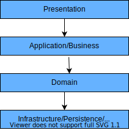

# Spring Boot Practice
- Spring Boot 백엔드 학습 프로젝트

## 프로젝트 구조
```text
src
├── main/java/com/autoever
│   ├── spring_practice
│   │   ├── SpringPracticeApplication.java
│   │   ├── constant
│   │   │   ├── ItemsSellStatus
│   │   │   └── OrderStatus
│   │   ├── controller
│   │   │   ├── AuthController
│   │   │   └── RestApiTestController
│   │   ├── dto
│   │   │   ├── MemberRegDto
│   │   │   └── MemberResDto
│   │   ├── entity
│   │   │   ├── Cart
│   │   │   ├── CartItem
│   │   │   ├── Order
│   │   │   ├── OrderItem
│   │   │   ├── Item
│   │   │   └── Member
│   │   └── repository
│   │       ├── CartRepository
│   │       ├── ItemRepository
│   │       ├── MemberRepository
│   │       └── OrderRepository
│   ├── resources
│   │   ├── application.properties
│   │   └── application-test.properties
│   └── resources
└── test/java/com/autoever/spring_practice
    ├── SpringPracticeApplicationTests
    └── repository
        ├── OrderRepositoryTest
        ├── ItemRepositoryTest
        └── CartRepositoryTest
```
- - -
## 계층형 아키텍처(Layered Architecture)

소프트웨어 아키텍처는 시스템이 제대로 작동하고 동작하도록 하기 위한 모든 소프트웨서 시스템의 기본 구조이다.
**아키텍처**는 일반적으로 물리적 설계를 의미하지만, 소프트웨어 시스템에서는 구성 요소의 설계, 구성 요소 간의 관계, 사용자 상호작용, 그리고 시스템에 대한 사용자 요구 사항을 포괄한다.

**계층형 아키텍처란?**
- 가장 일반적인 아키텍처 프레임워크로 n계층 아키텍처라고도 한다.  
- 여러 개의 개별 수평 계층이 하나의 소프트웨어 단위로 함께 작동하는 아키텍처 패턴을 설명한다.  
  - 계층은 구성 요소 또는 코드를 논리적으로 분리한 것이다.
- 계층형 아키텍처의 계층 수는 특정 개수로 정해져 있지 않다.
  - 일반적으로 개발자나 소프트웨어 설계자에 따라 달라진다.
- 다음은 일반적인 경우의 계층형 아키텍처이다.
  


1. 프레젠테이션 계층(presentation layer): 소프트웨어 시스템과의 사용자 상호 작용을 담당한다.
2. 애플리케이션 계층(application layer): 기능 요구 사항 달성과 관련된 측면을 처리한다.
3. 도메인 계층(domain layer): 핵심 비즈니스 로직, 알고리즘, 프로그래밍 구성 요소를 담당한다.
4. 인프라/영속성/DB 계층(Infrastructure/persistence/Database layer): 데이터 및 데이터베이스 통신을 담당한다. 

> 이외에는 헥사고날 아키텍처, 클린 아키텍처, 모놀리식 구조, 마이크로서비스 아키텍처 등이 있다.

### 코드의 계층형 아키텍처
1. 프레젠테이션 계층
  ```text
  controller  
  ├── AuthController
  └── RestApiTestController
  ```
2. 애플리케이션 계층
  - 현재 애플리케이션 계층의 코드는 없음. 
3. 도메인 계층
  ```text
  entity  
  ├── Item
  └── Member
  constant
  └── ItemSellStatue
  ```
4. 인프라/ 영속성 계층
  ```text
  repository  
  └── ItemRepository
  ```


**DTO란?**

- DTO(Data Transfer Object)는 계층 간 데이터 전달을 위한 구조체로, 일반적으로 **컨트롤러와 서비스 계층 사이에서 사용**됩니다.
- 특정 계층에 속하지는 않지만, 주로 **프레젠테이션 계층과 애플리케이션(비즈니스) 계층 사이에서 데이터 전달** 역할을 수행합니다.
- DTO는 **Entity와 분리되어 설계되며**, 이를 통해 다음과 같은 장점을 얻을 수 있다.:
  - **보안성**: DB 구조를 외부에 그대로 노출하지 않음
  - **유연성**: 요청/응답에 맞게 필요한 데이터만 구성 가능
  - **관심사 분리**: 데이터 전달과 DB 저장 목적을 명확히 구분


- 위 구조는 Spring 기반의 웹 애플리케이션 계층 구조(MVC + Layered Architecture)입니다.
- DTO와 Entity를 분리함으로써 **데이터의 이동과 저장 책임을 구분**하고, 유지보수성과 확장성을 높인 구조이다.

- - -
### 애플리케이션 진입점
이해의 편의를 위해 애플리케이션 진입점 부터 설명함.
- - -
#### SpringPracticeApplication.java
스프링 부트 애플리케이션의 진입점
```java
package com.autoever.spring_practice;

import org.springframework.boot.SpringApplication;
import org.springframework.boot.autoconfigure.SpringBootApplication;

@SpringBootApplication
public class SpringPracticeApplication {
	public static void main(String[] args) {
		SpringApplication.run(SpringPracticeApplication.class, args);
	}
}
```
**코드 설명**
- `@SpringBootApplication`: 스프링 부트 애플리케이션의 시작 지점을 나타내는 애너테이션
- 애플리케이션의 실행 시작점으로, 톰캣 서버 실행, Bean 등록, 설정 파일 로드 등을 자동으로 처리한다.

### 도메인 계층
도메인 계층은 핵심 비즈니스 모델을 정의하는 계층이며, 상위 계층(예: `Item`, `Member`) 등이 도메인 객체를 이용하기 때문에,  
이해의 편의를 위해 도메인 계층부터 설명한다.

- - -
#### Item.java
- 상품 정보를 저장하는 JPA 엔티티로 해당 클래스는 `item` 테이블과 매핑됨.
  - 상품명, 가격, 재고 수향, 설명, 판매 상태 등을 표현함.
- 다음 코드를 통해 시스템에서 상품 정보를 DB에 저장하고 활용하기 위한 도메인 모델이다.

```java
package com.autoever.spring_practice.entity;

import com.autoever.spring_practice.constant.ItemsSellStatus;
import lombok.Getter;
import lombok.Setter;
import lombok.ToString;

import javax.persistence.*;
import java.time.LocalDateTime;

@Getter @Setter // Lombok이 getter와 setter 메서드를 자동을 생성해주는 애너테이션이다.
@ToString // ToString: toString() 메서드를 자동으로 생성하여 객체를 로깅할 때 각 필드의 값을 보기 쉽게 출력한다.
@Entity // 현재 클래스가 JPA에서 관리되는 엔티티 클래스임을 선언하는 애너테이션이다.
@Table(name = "item") // 엔티티가 매핑될 실제 DB 테이블의 이름을 지정한다.

public class Item {
    @Id // 해당 필드(id)가 기본 키(Primary Key) 역할을 한다고 지정한다.
    @Column(name = "item_id")
    @GeneratedValue(strategy = GenerationType.AUTO)
    private Long id; // @Id가 가리키는 필드

    @Column(nullable = false, length = 50)
    private String itemName;

    @Column(nullable = false)
    private int price;

    @Column(nullable = false)
    private int stockNumber; // 재고 수량, DB에서는 자동으로 snake 표기법으로 자동 변경된다.

    @Lob // 해당 필드(itemDescription)를 대용량 데이터로 처리한다는 의미
    @Column(nullable = false, name = "item_description")
    private String itemDescription;

    @Enumerated(EnumType.STRING) // Enum 타입을 DB에 저장할 때 어떤 방식으로 저장할 지 결정한다.
    private ItemsSellStatus itemsSellStatus;

    private LocalDateTime regDate;
    private LocalDateTime updateTime;
}
```

**코드 설명**
- 기본 키
  - `id`: 기본 키(PK, Primary Key)로 자동 생성 전략으로 자동 생성된다.
- 상품 정보 필드
  - `itemName`: 50자 제한이며, `null` 값을 허용하지 않음
  - `price`: `null`이 아닌 가격
  - `stockNumber`: 재고 수량
  - `itemDescription`: `null`이 아닌 상품 설명, 대용량 텍스트
  - `itemSellStatus`: 판매 상태(열거형 ENUM)
  
- 등록일
  - `regDate`: `LocalDateTime`을 이용하여 등록 일시 저장
  - `updateTime`: `LocalDateTime`을 이용하여 수정 일시 저장
    - JPA가 해당 객체를 persist(처음으로 데이터베이스에 저장하기 직전) 되기 전 등록일 필드에 현재 시간 자동 할당함.
    - 즉, `memberRepository.save(member);` 호출 시, persist가 발생한다.

- **JPA 애너테이션**
  - `@Entity`: 현재 클래스가 JPA에서 관리되는 엔티티 클래스임을 선언하는 애너테이션이다.
  - `@Table`: 엔티티가 매핑될 실제 DB 테이블의 이름을 지정한다.
    - Param: name = ""
    - 기본값으로는 클래스의 이름이 snake_case로 자동 설정된다.
  - `@Id`: 해당 필드가 기본 키(Primary Key) 역할을 한다고 지정한다.
    - 모든 JPA 엔티티는 반드시 하나의 `@Id` 필드를 가져야한다.
    - 기본 키: 관계형 데이터베이스(RDBMS)에서 테이블의 각 행(row)을 고유하게 식별하기 위해 사용하는 유일한 값이다.
  - `@GeneratedBValue`: 기본 키 값을 지정한다.
    - `strategy = GenerationType.AUTO`: 기본 키 값을 자동 생성 전략을 채택하여 생성함.
  - `@Column()`: 필드를 DB 컬럼에 매핑할 때 세부 설정을 지정한다.
    - Param: `nullable`, `lenght`, `unique`, `name`
  - `@Lob`: 해당 필드를 대용량 데이터로 처리한다는 의미
    - 예시) 문자열의 경우 `CLOB` 타입으로 저장, 바이너리 데이터의 경우 `BLOB`으로 저장한다.
  - `@Enumerated`: `Enum` 타입을 DB에 저장할 때 어떤 방식으로 저장할 지 결정한다.
    - Param: `EnumType.STRING`: `enum` 이름 자체를 문자열로 저장함. 권장되는 방식이다.
  - `@PrePersist`: 엔티티가 DB에 저장되기 직전에 실행되는 애너테이션이다.
    - 사용 목적: 등록 일시 설정, 기본 값 설정, 로깅 등 사전 처리에 사용된다.

- **Lombok 애너테이션**
  - `@Getter`, `@Setter`: 모든 필드에 대한 get, set 메서드를 자동으로 생성한다.
  - `@ToString`: `toString()` 메서드를 자동으로 생성하여 객체를 로깅할 때 각 필드의 값을 보기 쉽게 출력한다.
  - `@NoArgsConstructor`: 파라미터가 없는 기본 생성자를 자동 생성한다.
    - JPA 규칙: **JPA는 리플렉션을 통해 객체를 생성하므로 기본 생성자가 반드시 필요**하다.
    - 리플렉션(Reflection): 클래스, 메서드, 필드 등의 정보를 런타임에 조회하거나 동적으로 조작할 수 있는 기능이다.

- - -
#### Member.java
- Member 클래스는 사용자 정보를 관리하는 JPA 엔티티이다.
- 해당 클래스는 `member` 테이블과 매핑되며 이름, 이메일, 비밀번호, 프로필 이미지 등을 포함한다.
- 인증, 사용자 관리 기능을 위해 사용되는 기본적인 회원 도메인이다.

```java
package com.autoever.spring_practice.entity;

import lombok.Getter;
import lombok.Setter;
import lombok.NoArgsConstructor;

import javax.persistence.*;
import java.time.LocalDateTime;

@Entity // Member 클래스가 JPA 엔티티임을 나타낸다.
@Table(name = "member") // Member 엔티티가 매핑될 테이블의 이름을 지정한다.
@Getter @Setter // Lombok이 제공하는 자동 getter, setter 메서드 생성 애너테이션
@NoArgsConstructor // 기본 생성자 생성 애너테이션
public class Member {
    @Id
    @GeneratedValue(strategy = GenerationType.AUTO)
    @Column(name = "member_id")
    private Long id;

    @Column(length = 100)
    private String name;

    @Column(nullable = false)
    private String password;

    @Column(unique = true, length = 150)
    private String email;

    @Column(length = 255)
    private String image;

    private LocalDateTime regDate;
    
    @PrePersist // 엔티티가 DB에 저장되기 직전에 실행되는 메서드
    private void prePersist() {         // 라이프사이클 콜백 메서드
        regDate = LocalDateTime.now();  // regDate 필드에 현재 시간 자동 저장된다.
    }
}
```

**코드 설명**
- 기본 키
  - `id`: 기본 키(PK, Primary Key)로 자동 생성 전략으로 자동 생성된다. 
- 회원 정보 필드
  - `name`: 최대 100자까지 허용되는 이름
  - `password`: `null`이 될 수 없는 비밀번호
  - `email`: 유일한(unique) 이메일 주소
  - `image`: 프로필 이미지나 `url`주소
- 등록일
  - `regDate`
    - JPA가 해당 객체를 persist(처음으로 데이터베이스에 저장하기 직전) 되기 전 등록일 필드에 현재 시간 자동 할당함.
    - 즉, `memberRepository.save(member);` 호출 시, persist가 발생한다.

#### Cart
- 회원(Member)이 보유한 장바구니(Cart) 정보를 저장하고 관리하는 도메인 객체이다.
- 회원과 1:1 관계를 가지며 장바구니 식별자, 이름, 소유자를 포함하는 구조를 가지고 있다.
- 
```java
package com.autoever.spring_practice.entity;

import lombok.Getter;
import lombok.Setter;
import lombok.ToString;

import javax.persistence.*;

@Getter
@Setter
@ToString
@Entity
@Table(name = "cart")
public class Cart {
    @Id
    @Column(name = "cart_id")
    @GeneratedValue(strategy = GenerationType.AUTO)
    private Long id; // cart에 대한 id 생성

    @Column(nullable = false, length = 50)
    private String cartName;

    @OneToOne // Member entity와 1대1 매핑
    @JoinColumn(name = "member_id")
    private Member member; // 생성된 회원 객체가 와야 한다.
}
```
**코드 설명**
- 기본 키
  - `id`: 장바구니의 고유 식별자
- 장바구니 정보 필드
  - `cartName`: 장바구니의 이름
  - `member`: 장바구니를 소유한 회원
    - `member_id`로 외래 키 매핑됨.
- 관계도
  ```text
  [Member] 1 ---- 1 [Cart]
              member_id(FK)
  ```
  - 각 회원은 하나의 장바구니를 가질 수 있으며, 장바구니는 하나의 회원에 귀속되어야함.

#### CartItem
- `CartItem`은 장바구니(`Cart`)에 담긴 개별 상품(`Item`)의 정보를 표현하는 연결 엔티티이다.
- 장바구니와 상품 간의 N:M(ManyToMany) 관계를 중간 테이블 형태로 모델링 한다.
  - 하나의 장바구니는 여러 상품을 담을 수 있고, 하나의 상품은 여러 장바구니에 포함될 수 있음.
  - 또한, 동일한 상품이 장바구니에 여러 개 담길 수 있으므로, 수량(`count`) 필드를 통해 명시적으로 관리함.
  - JPA 연관 매핑(`@ManyToOne`) 어노테이션을 통해 `Cart`와 `Item`과의 관계를 선언하여 객체 그래프 탐색을 가능하게 구성됨.
  
```java
package com.autoever.spring_practice.entity;

import lombok.Getter;
import lombok.Setter;
import lombok.ToString;

import javax.persistence.*;

@Getter
@Setter
@ToString
@Entity
public class CartItem {
    @Id
    @GeneratedValue(strategy = GenerationType.AUTO)
    @Column(name = "cart_item_id")
    private Long id;

    @ManyToOne // 여러 cartItem이 하나의 Cart에 속하므로 N = 1
    @JoinColumn(name = "cart_id")
    private Cart cart;

    @ManyToOne
    @JoinColumn(name = "item_id")
    private Item item;

    private int count;
}
```

**코드 설명**
- 기본 키
  - `id`: `CartItem`의 기본 키
- 장바구니 상품 정보 필드
  - `cart`: `Cart`와의 다대일 관계를 가짐
    - `CartItem`이 하나의 Cart에 속함.
  - `item`: `Item`과의 다대일 관계를 가짐
    - 여러 `CartItem`이 동일한 `Item`을 참조할 수 있음.
  - `count`: 해당 `Item`의 수량
- 관계도
  ```text
  [Cart] 1 ---- N [CartItem] N ---- 1[Item]
  ```
  - 하나의 `Cart`는 여러 개의 `CartItem`을 가질 수 있음.
  - 하나의 `CartItem`은 오직 하나의 `Cart`, `Item`에만 속함.
  - 다대다(N:M) 관계를 표현하는 중간 테이블 엔티티 설계의 형태임.

#### Order
- 고객 상품의 주문 정보를 표현하는 클래스이다.
- 하나의 주문에 여러 주문 항목(`OrderItem`)이 포함되는 주문 도메인 루트 엔티티이다.
- 목적
  - 주문 정보를 엔티티로 모델링하여 고객이 어떤 상품을 언제, 어떤 상태로 주문했는지 영속성 있게 관리
  - 한 명의 회원이 여러 개의 주문을 할 수 있으므로 다대일 관계로 설정
  - 하나의 주문은 여러 개의 주문 항목으로 구성되므로 일대다 관계로 설정
```java
package com.autoever.spring_practice.entity;

import java.util.List;
import com.autoever.spring_practice.constant.OrderStatus;
import lombok.Getter;
import lombok.Setter;
import lombok.ToString;

import javax.persistence.*;
import java.time.LocalDateTime;
import java.util.ArrayList;

@Getter
@Setter
@ToString
@Entity
@Table(name = "orders") // DB의 예약어와의 충돌을 방지하기 위해 table의 이름을 orders로 변경
public class Order {
    @Id
    @GeneratedValue
    @Column(name = "order_id")
    private Long id;

    @ManyToOne
    @JoinColumn(name = "member_id")
    private Member member;

    private LocalDateTime orderDate; // 주문 일

    @Enumerated(EnumType.STRING)
    private OrderStatus orderStatus;

    private LocalDateTime regTime;
    private LocalDateTime updateTime;

    @OneToMany(mappedBy = "order", cascade = CascadeType.ALL)
    private List<OrderItem> orderItemList = new ArrayList<>();
}

```

**코드 설명**
- 기본 키
  - `id`: `Order`의 기본 키
- 주문 정보 필드
  - `member`: 주문한 회원 정보와 다대일로 연관됨.
  - `orderDate`: 주문 발생 시각
  - `orderStatus`: 주문 상태(예: ORDER, CANCEL)
  - `regTime`/ `updateTime`: 생성/수정 시간 기록
  - `orderItemList`: 주문에 포함된 상품 항목 리스트
    - 여러 `CartItem`이 동일한 `Item`을 참조할 수 있음.
  - `count`: 해당 `Item`의 수량
- 관계도
  ```text
  [Member] 1 ---- N [Order] N ---- 1[OrderItem]
  ```
  - 하나의 회원은 여러 주문을 생성할 수 있음.
  - 하나의 주문은 여러 개의 주문 항목을 포함할 수 있음.

#### OrderItem
- `OrderItem`은 하나의 주문에 포함된 개별 상품의 상세 내역을 나타내는 엔티티로 어떤 상품이 몇 개, 얼마에 주문되었는지 표현한다.
- `Order`와 `Item` 사이의 다대다(N:M) 관계를 해소하기 위한 중간 테이블의 역할을 수행한다.
- 목적
  - `Order`와 `Item`은 직접적인 다대다 관계 대신, 중간 엔티티 `orderItem`을 통해 다대일 관계로 두 개로 구성함.
  - 상품 가격, 수량, 등록 시간 등의 주문의 상세 데이터를 개별 항목 단위로 관리함.
  - JPA를 통한 연관 관계 매핑으로 데이터 정합성과 일관성을 유지함.

```java
package com.autoever.spring_practice.entity;

import lombok.Getter;
import lombok.Setter;
import lombok.ToString;

import javax.persistence.*;
import java.time.LocalDateTime;

@Getter
@Setter
@ToString
@Entity

public class OrderItem {
    @Id
    @GeneratedValue
    @Column(name = "order_item_id")
    private Long id;

    @ManyToOne
    @JoinColumn(name = "item_id")
    private Item item;

    @ManyToOne
    @JoinColumn(name = "order_id")
    private Order order;

    private int orderPrice;
    private int count;
    private LocalDateTime regTime;
}

```

**코드 설명**
- 기본 키
  - `id`: `OrderItem`의 기본 키
- 주문 정보 필드
  - `item`: 해당 주문 항목에 포함된 상품
  - `order`: 주문 항목이 속한 주문
  - `orderPrice`: 해당 항목의 가격
  - `count`: 주문된 수량
  - `regTime`: 주문 항목 등록 시각
- 관계도
  ```text
  [Order] 1 ---- N [OrderItem] N ---- 1[Item]
  ```
  - 한 주문은 여러 개의 주문 항목을 가질 수 있음.
  - 각 주문 항목은 하나의 상품에 대응됨.

- - -
### 영속성 계층
- 영속성 계층(persistence layer)은 도메인 객체와 데이터베이스 간의 CRUD의 작업을 담당하는 계층이다.
- 주로 **Repository interface**를 통해 구현된다.
- 비즈니스 로직과 데이터 접근 로직을 명확히 분리하여 유지보수성과 확장성을 높인다.
- Spring에서는 Spring Data JPA를 통해 복잡한 구현 없이도 JPA 기반의 데이터 접근 기능을 추상화하고 자동화 한다.

**Repository 구성 목록**
- ItemRepository: 상품의 이름, 설명 기반 CRUD 기능 제공
- CartRepository: 장바구니 정보에 대한 CRUD 기능 제공
- MemberRepository: 회원에 대한 CRUD 기능 제공
- OrderRepository: 주문에 대한 CRUD 기능 제공

- - -
#### ItemRepository
- `Item`엔티티에 대한 데이터 접근 기능을 담당하는 JPA 기반 Repository 인터페이스이다.
- 비즈니스 로직과 분리된 데이터 접근 로직(Data Access Login)을 정의한 것이다.
- Spring Data JPA의 추상화를 활용하여, 반복적인 CRUD 코드 없이도 쿼리 메서드를 자동 생성 및 활용 가능하다.

```java
package com.autoever.spring_practice.repository;

import java.util.List;
import com.autoever.spring_practice.entity.Item;
import org.springframework.data.jpa.repository.JpaRepository;
import org.springframework.data.jpa.repository.Query;
import org.springframework.data.repository.query.Param;
import org.springframework.stereotype.Repository;

@Repository // Spring이 해당 인터페이스를 Repository Bean으로 인식하게 하는 애너테이션

public interface ItemRepository extends JpaRepository<Item, Long> {
    List<Item> findByItemName(String itemName); // item_name을 이용하여 상품 검색
    List<Item> findByItemNameOrItemDescription(String itemName, String itemDescription); // item_name 또는 description을 이용하여 상품 검색
    
    // JPQL 기반의 쿼리 메서드
    @Query("SELECT i FROM Item i WHERE i.itemDescription like %:itemDescription% ORDER BY i.price desc")
    List<Item> findByItemDescription(@Param("itemDescription") String itemDescription);

    // Native Query 기반의 쿼리 메서드: 해당하는 DB의 실제 쿼리를 작성, 복잡한 쿼리를 작성 가능하다.
    @Query(value = "SELECT * FROM item i WHERE i.item_description " +
            "LIKE %:itemDescription% ORDER BY i.price DESC", nativeQuery = true)
    List<Item> findByItemDescriptionByNativeQuery(@Param("itemDescription") String itemDescription);
}
```

**코드 설명**
- 클래스 선언 부
  ```java
  @Repository
  public interface ItemRepository extends JpaRepository<Item, Long> { ... }
  ```
  - `@Repository`: Spring이 해당 인터페이스를 Repository Bean으로 인식하게 함.
  - `JpaRepository<Item, Long>`
    - `JpaRepository`는 `save()`, `findById()`, `delete()` 등의 기본 CRUD 메서드를 자동으로 제공함.
    - `<Item, Long>`: `Item` 엔티티의 기본 키 타입이 `Long`임을 명시함.

- **JPA 메서드**
  - findByItemName
    ```java
    List<Item> findByItemName(String itemName);
    ```
    - `item_name`이 특정 문자열과 일치하는 상품 목록 조회
    - JPQL 자동 생성 해줌, `SELECT i FROM Item i WHERE i.itemName = :itemName`
  - findByItemNameOrItemDescription
    ```java
    List<Item> findByItemNameOrItemDescription(String itemName, String itemDescription);
    ```
    - `item_name` 또는 `item_description`이 조건에 일치하는 상품을 검색함.
    - JPQL 자동 생성 쿼리문: `SELECT i FROM Item i WHERE i.itemName = :itemName OR i.itemDescription = :itemDescription`

- **JPQL 및 Native Query 기반 메서드**
  - JPQL 기반 메서드
    ```java
    @Query("SELECT i FROM Item i WHERE i.itemDescription like %:itemDescription% ORDER BY i.price desc")
    List<Item> findByItemDescription(@Param("itemDescription") String itemDescription);
    ```
    - `@Query`: JPA에서 제공하는 JPQL 쿼리
    - `@Param("itemDescription")`: 메서드 매개변수를 JPQL 쿼리 안의 :itemDescription에 바인딩
      > `String itemDescription`과 `@Param("itemDescription")`의 차이점  
      `String itemDescription`: Java 메서드의 매개변수.  
      `@Param("itemDescription")`: Spring Data JPA에서 Native Query에 전달할 파라미터의 이름을 지정하는 애너테이션.  
    - `itemDescription`에 특정 문자열이 포함된 상품을 가격 기준으로 내림차순 정렬하여 조회함.
  - Native Query 기반 메서드
    ```java
    @Query(value = "SELECT * FROM item i WHERE i.item_description " +
    "LIKE %:itemDescription% ORDER BY i.price DESC", nativeQuery = true)
    List<Item> findByItemDescriptionByNativeQuery(@Param("itemDescription") String itemDescription);
    ```
    - `@Query`의 `nativeQuery = true`로 실제 SQL 문장을 작성한 것임을 명시함.
    - 마찬가지로 `@Param("itemDescription")`으로 메서드 매개변수를 SQL 쿼리 안의 :itemDescription에 바인딩함.

- - -
#### MemberRepository


- - -
#### OrderRepository


- - -
#### CartRepository


####
- - -
## 추가 개념 설명
### 영속성
**영속성?**
- 데이터가 일시적이지 않고, 애플리케이션이 종료되어도 유지되는 특성을 의미한다.
- 예시) 한 번 저장하면 꺼졌다 켜도 남아있는 데이터로 회원가입 후 로그아웃 했다가 로그인해도 정보가 남아 있는 것.
- 비영속(Transient): 메모리에서만 존재하고 저장되지 않은 상태

**JPA의 영속(Persistent) 상태란?**
- JPA에서 특정 객체(Entity)를 **EntityManager**가 관리하고 있는 상태이다.
- 이 상태의 객체는 DB의 한 행(row)과 1:1로 연결되어 있고, 변경사항은 자동으로 감지되어 DB에 반영한다.

**영속화?**
- 비영속 상태의 객체를 영속 상태로 만드는 것이다.
- JPA의 `EntityManager.persist()` 메서드를 통해 이루어진다.
```java
Member member = new Member(); // 현재 비영속 상태
member.setName("DKim");

// em(EntityManager)의 persist로 member를 영속화한다.
em.persist(member); 

```

- - -
## 참고 자료
- https://www.baeldung.com/cs/layered-architecture